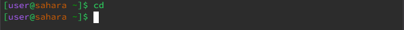
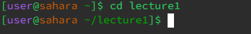
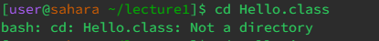
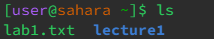
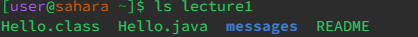
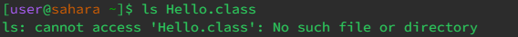
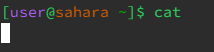
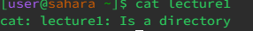
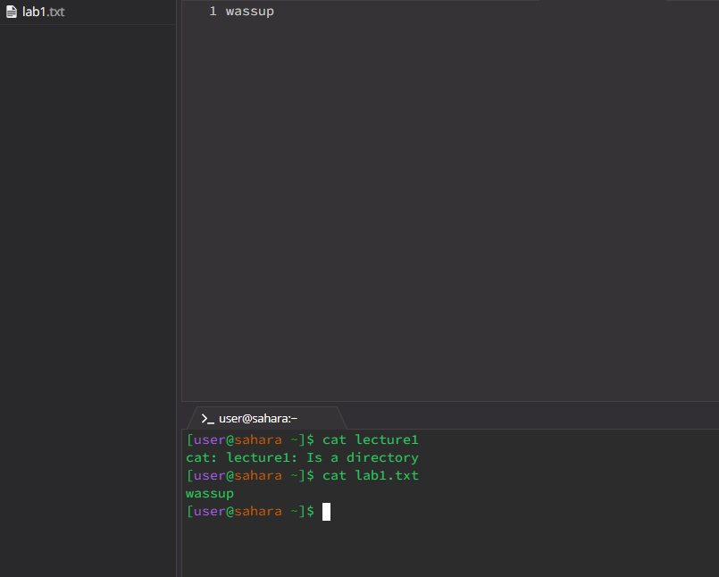

In this lab I learned how to go through the files using only the terminal. We did the same thing in the lecture as well and it was very helpful since I was able to practice it even more in lab. Additionally learning how to create a website on github was very interesting. While creating the website I did have trouble since i was on an iPad however the TA was able to help me and I was able to successfully create the website.

a) cd

  1) 
     
  2) 
     
  3)  

b) ls

  1) 
     
  2) 
     
  3) 

c) cat

  1) 
     
  2) 
     
  3) 
