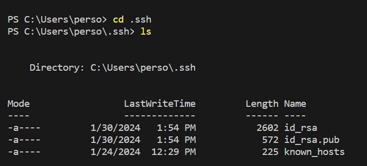

 

2) 

The methods that are called in this screenshot are the getPath(), getQuery(), indexOf(), length() and subString(). When calling the getPath method, it makes sure that the url has the "/add-message". It proceeds to use the getQuery method to get the query component as a string. It then uses the indexOf method to get the index of the start of the message and the end of the message, the arguments used are the "s=", "&", and "&user=". By using the indexes as the argument, it creates a substring to extract the message. It does the same for the user. Finally, by using the length method it checks if the length of the user and message is greater than 0, it then prints out the message including the user. 

3) 

The methods that are called are the getPath(), getQuery(), indexOf(), subString(), and the replace(). It first calls the getPath method to make sure that the url has the "/add-message". It then uses the getQuery method to get the query component as a string. By using the indexOf method it gets the index of the start message and the end of the message. The arguments are not changed since "s=", "&", and "&user=" are used all the time in order to do the message. By using the indexes as the argument, it creates a substring to extract the message. It does the same for the user. Finally, it uses the length method to make sure that the argument is valid and proceeds to print the message. 

4) 

5) 

6) 

In these past two weeks I have learned a lot about the terminal and servers. One of the main things I did not know was how to start a server. However in these past two labs we learned how to open a server and even build one! Although it was kind of confusing to write the code for the chatserver, with the help of the TAs and the example NumberServer, I was able to create the server. 
