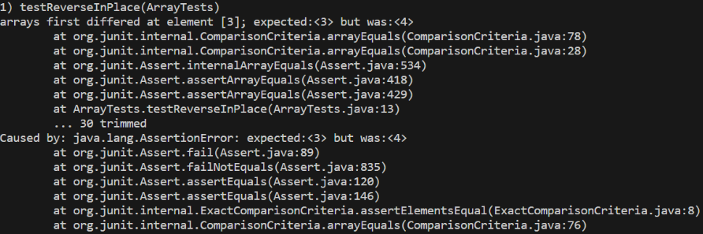

part 1)

a.

```  
int[] input2 = {1,2,3};
    ArrayExamples.reverseInPlace(input2);
    assertArrayEquals(new int[]{3,2,1}, input2);
```

b. 

```  
int[] input1 = { 3 };
    ArrayExamples.reverseInPlace(input1);
    assertArrayEquals(new int[]{ 3 }, input1);
```

c. 



d.

before code:

```
static void reverseInPlace(int[] arr) {
    for(int i = 0; i < arr.length; i += 1) {
      arr[i] = arr[arr.length - i - 1];
    }
  }
```

after code:

```
static void reverseInPlace(int[] arr) {
    for (int i = 0; i < arr.length / 2; i++) {
      int temp = arr[i];
      arr[i] = arr[arr.length - i - 1];
      arr[arr.length - i - 1] = temp;
    }
  }
```

e. 

The after code works since the first code overwrites the original values before they are swapped. So in the new code, it creates an object that holds the original value so then it doesn't completely get overwrited and it gets swapped properly. Additionally, by dividing the arr.length by 2 it makes it so then the valuesa are swapped around the midpoint. If it isn't divided by 2 then the values would just go to their original positions and be wrong. 

part 2)

find command

find "____" /v /c "file path" 

a) 

```
find "WE HAVE SOME PLANES" /v /c "911report\chapter-1.txt"

---------- 911REPORT\CHAPTER-1.TXT: 730
```

In this command the /v is finding all the lines in the 911report\chapter-1.txt file that doesn't have the string: "WE HAVE SOME PLANES". It outputs all of th.

b) 

```
find "WE HAVE SOME PLANES" /v /c "911report\chapter-2.txt"

---------- 911REPORT\CHAPTER-2.TXT: 948
```

This time, it is counting all of the lines in the 911report\chapte-2.txt file that don't have the string: "WE HAVE SOME PLANES". Since this file doesn't contain this phrase, it just outputs number of all of the lines. 


findstr /i "_____" "(file path)"

a) 

```
findstr /i "weather" "911report\chapter-1.txt"
For those heading to an airport, weather conditions could not have been better for a safe and pleasant journey. Among the travelers were Mohamed Atta and Abdul Aziz al Omari, who arrived at the airport in Portland, Maine.
```

In this command it is outputting all of the lines that have the string "weather" in it. The /i searches through the .txt file to find the string. The findstr allows us to output the strings.

b) 

```
findstr /i "eram" "911report\chapter-1.txt"
```

This time, since "eram" is not in any of the lines in this file, it outputs nothing.  


findstr /n "___" "(file path)"

a)

```
findstr /n "weather" "911report\chapter-1.txt"
8: For those heading to an airport, weather conditions could not have been better for a safe and pleasant journey. Among the travelers were Mohamed Atta and Abdul Aziz al Omari, who arrived at the airport in Portland, Maine.
```

In this command it finds the line where it has the string "weather" in the 911report\chapter-1.txt file. It outputs the string and the line number. 

b) 

```
findstr /n "kevin" "911report\chapter-1.txt"
```

Since "kevin" is not in any of the lines in this file, it outputs nothing.  


find "____" "(file path"

a) 

```
findstr "weather" "911report\chapter-1.txt"
For those heading to an airport, weather conditions could not have been better for a safe and pleasant journey. Among the travelers were Mohamed Atta and Abdul Aziz al Omari, who arrived at the airport in Portland, Maine.
```

In this command it prints the line that has the string "weather" in it. 

b)

```
findstr "eram" "911report\chapter-1.txt"
```

It does not output anything since "eram" isn't in any of the lines in the file. 
