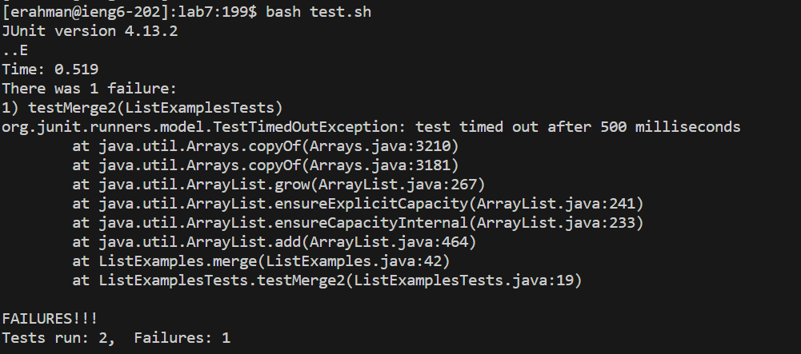

`<up arrow key>``<enter>`

Since I already logged into the ssh in the past, I used the up arrow key to go to my past actions and log in. 

 cd <space> lab7<enter>
git `<space>` clone `<space>` `<right click>` `<enter>`

I changed my directory into the lab7 folder and cloned the ssh url into it.

bash test.sh `<enter>`

This shows that the test does not pass before making changes. 

vim`<space>`ListExamples.java`<enter>`
/1`<enter>`
NN
dw
i
2 `<space>`
`<escape>`
:wq`<enter>`

I go into the vim for ListExamples.java and change the index1 to a index2. 

<up arrow key> <up arrow key><enter>

Since I did the bash test.sh command before, I press my up arrow key twice to go back to it. This shows that after making the changes the tests pass. 

git<space>com<tab><space>-m “fixed”`<enter>`

I commit the changes with a message "fix"`<enter>`

git<space>push<space>or<tab><space>m<tab><enter>

I push the change into my github account. 
